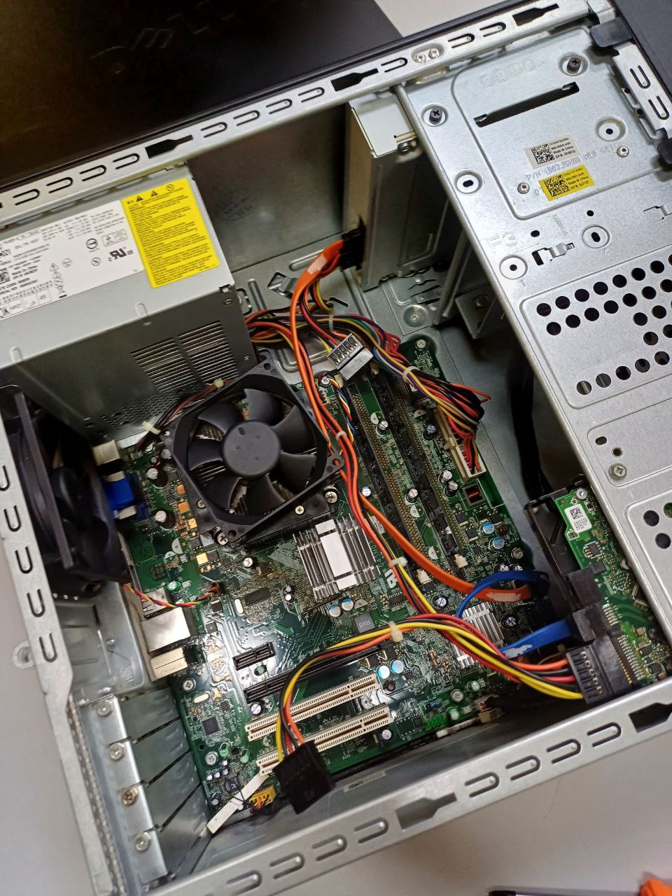
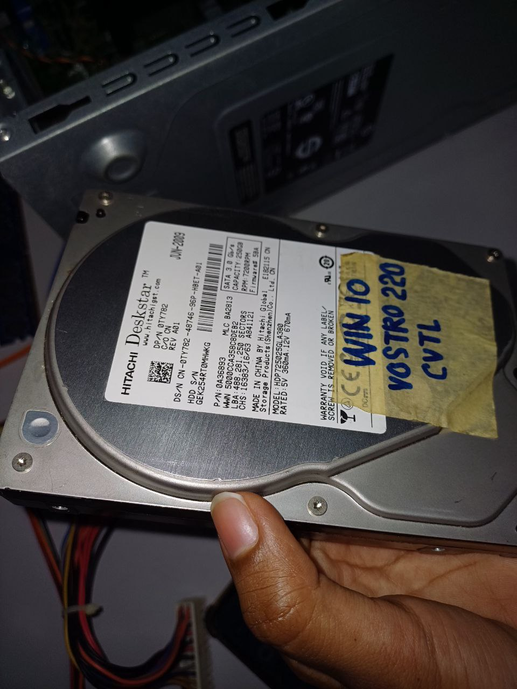
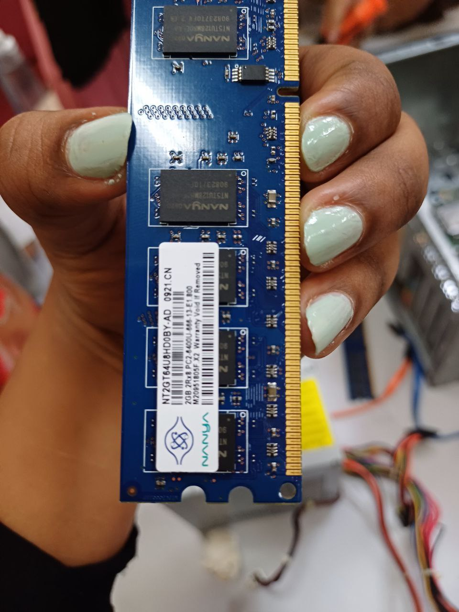
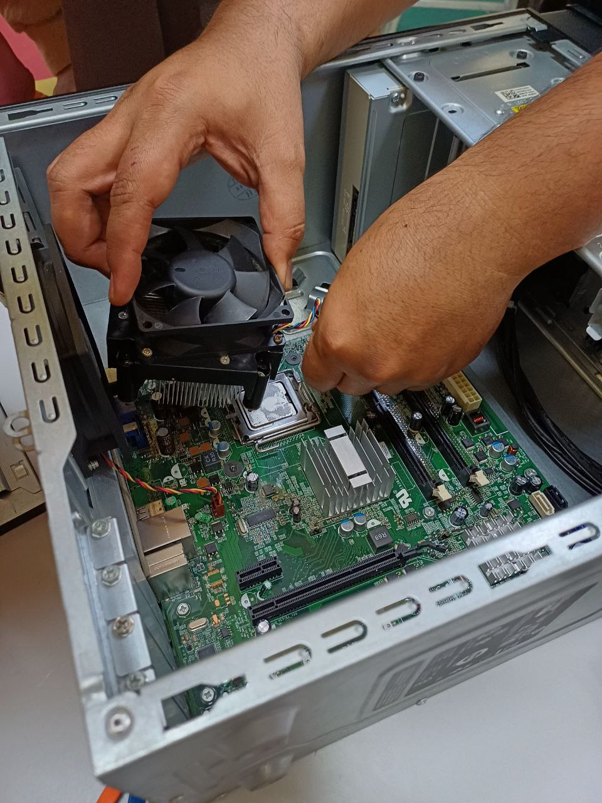

# PC Assembling Lab - Reflection

## Overview
The PC Assembling Lab was an engaging and fun experience that I got to have with my team, we took out the tower components of our PC and reassembled then the DR gave us a quiz on it.
Here’s a photo from the lab showing the disassembled PC components:

## Key Takeaways
- **Component Exploration**: During the lab, we removed and examined key components of the tower using a PHILLIPS SCREW DRIVER, including:
  - **Power Supply Unit (PSU)**: Learned about its role in distributing power to various components and its wiring connections.
  - **Hard Disk Drive (HDD)**: Understood its function in data storage and how it interfaces with the motherboard.
    

  - **RAM**: Identified the physical differences, purposes, and installation process for these memory units and examined its capacity.
    

  - **Cooling System**: Observed the fan setup and its role in maintaining system temperature.
    

- **Connection Understanding**: Studied the wiring and connections between components, such as power cables, graphical card and peripheral connectors, and how they enable communication within the system.
- **Reassembly and Testing**: Reassembled the system and ensured proper functionality.

## Reflection
This lab provided a comprehensive look at the inner workings of a computer system. By physically interacting with the components, I gained:
- **Practical Knowledge**: A hands-on experience of hardware roles and how they integrate to create a functional PC.
- **Problem-Solving Skills**: Experience troubleshooting issues such as incorrect connections and misaligned components during reassembly.

## Importance of This lab
This experience bridged the gap for me between theoretical learning and practical application. It highlights my ability to work with hardware and contributes to my growth as a well-rounded software engineering student.
